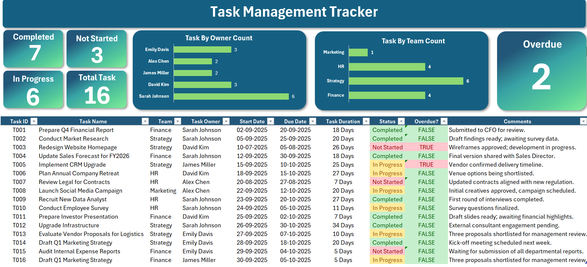

# Excel Task Management Dashboard

### Project Overview

This project is a self-contained, interactive Task Management Dashboard built in a single Microsoft Excel file. The goal is to provide a clear, at-a-glance view of project status, team workload, and key performance indicators (KPIs) to help managers make data-driven decisions.

All data, calculations, and visualizations are included within the `.xlsx` file.

---

### Key Features

* **KPI Summary Cards:** Displays high-level metrics like Total Tasks, Completed, In Progress, and Overdue.
* **Interactive Filtering:** The dashboard can be dynamically filtered by Team or Task Owner using Slicers.
* **Status by Team/Owner:** Stacked bar charts visualize the breakdown of task statuses for each team and individual.
* **Detailed Task List:** A table with conditional formatting that clearly shows the status and days remaining for each task.

---

### Tools & Techniques Used

* **Microsoft Excel:**
    * **Data Organization:** Source data is organized in a separate sheet within the workbook.
    * **PivotTables & Slicers:** Used to aggregate data and create interactive controls.
    * **Formulas & Conditional Formatting:** Logic-based formulas and visual formatting are used to calculate statuses and highlight key information.
    * **Charts:** All charts are native Excel charts linked to the PivotTable data.

---

### How To Use

1.  **Download the `.xlsx` file** from this repository.
2.  **Open the file in Microsoft Excel.**
3.  **Enable Content/Macros** if prompted (this allows the Slicers to work).
4.  **Interact with the Dashboard sheet** using the filter controls at the top.

---
